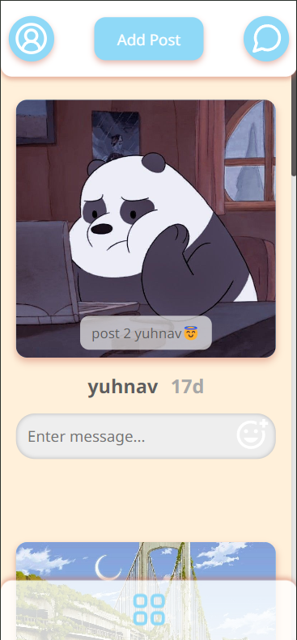
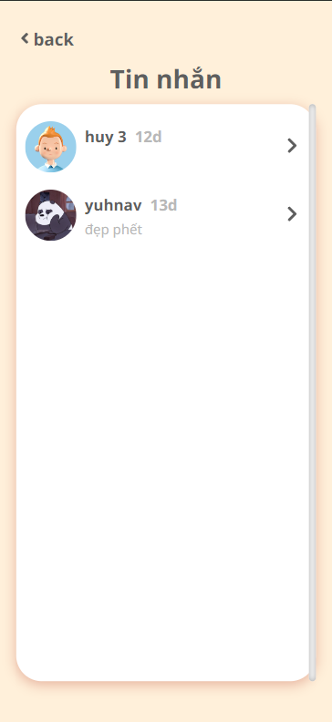

## Introduction

Locket allows user to share their moments through image and chat with each other

## Technology

- FrontEnd: Reactjs, Sass, Zustand
- Database: Firebase

## Features

- Upload image
- Comment, like moments
- Send, accept friend request
- Authorization
- Chat

## ScreenShots

- Register

- Login

- Home page

- Add post

- User

- Chat list

- Chat

- All shortcut

